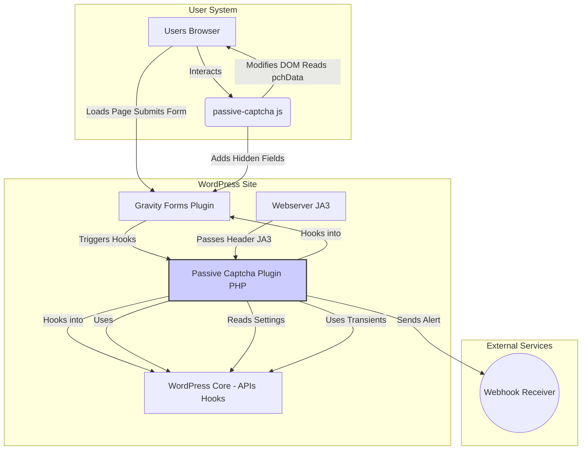

# Architecture

```mermaid
graph TD
    subgraph UserSystem [User System]
        B[Users Browser]
        JS(passive-captcha js)
    end

    subgraph WordPressSite [WordPress Site]
        WP[WordPress Core - APIs Hooks]
        GF[Gravity Forms Plugin]
        PCH_PHP[Passive Captcha Plugin PHP]
        WS[Webserver JA3]
    end

    subgraph ExternalServices [External Services]
        WH((Webhook Receiver))
    end

    B -- Interacts --> JS;
    B -- Loads Page Submits Form --> GF;
    JS -- Modifies DOM Reads pchData --> B;
    JS -- Adds Hidden Fields --> GF;

    PCH_PHP -- Hooks into --> WP;
    PCH_PHP -- Hooks into --> GF;
    PCH_PHP -- Uses --> WP;
    PCH_PHP -- Reads Settings --> WP;
    PCH_PHP -- Uses Transients --> WP;

    GF -- Triggers Hooks --> PCH_PHP;

    WS -- Passes Header JA3 --> PCH_PHP;
    PCH_PHP -- Sends Alert --> WH;

    style PCH_PHP fill:#ccf,stroke:#333,stroke-width:2px;
```
