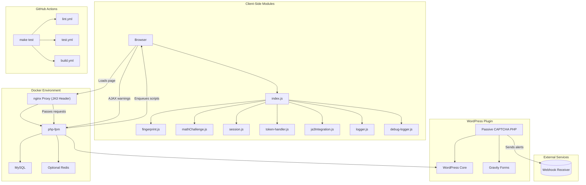

# Architecture

```mermaid
graph TD
  subgraph Client_Side [Client-Side Modules]
    B[Browser]
    IM[index.js]
    FL[fingerprint.js]
    ML[mathChallenge.js]
    SS[session.js]
    TH[token-handler.js]
    JA[ja3Integration.js]
    LG[logger.js]
    DBG[debug-logger.js]
    B --> IM
    IM --> FL
    IM --> ML
    IM --> SS
    IM --> TH
    IM --> JA
    IM --> LG
    IM --> DBG
  end

  subgraph WordPress_PHP [WordPress Plugin]
    WP[WordPress Core]
    GF[Gravity Forms]
    PCH[Passive CAPTCHA PHP]
    PCH --> WP
    PCH --> GF
  end

  subgraph Infrastructure [Docker Environment]
    NGINX["nginx Proxy (JA3 Header)"]
    PHPFPM[php-fpm]
    MYSQL[MySQL]
    REDIS[Optional Redis]
    NGINX --> PHPFPM
    PHPFPM --> MYSQL
    PHPFPM --> REDIS
    PHPFPM --> WP
  end

  subgraph CI_CD [GitHub Actions]
    MAKE["make test"]
    LINT[lint.yml]
    TEST[test.yml]
    BUILD[build.yml]
    MAKE --> LINT
    MAKE --> TEST
    MAKE --> BUILD
  end

  subgraph External [External Services]
    WH[(Webhook Receiver)]
  end

  B -- Loads page --> NGINX
  NGINX -- Passes requests --> PHPFPM
  PHPFPM -- Enqueues scripts --> B
  B -- AJAX warnings --> PHPFPM
  PCH -- Sends alerts --> WH
```
