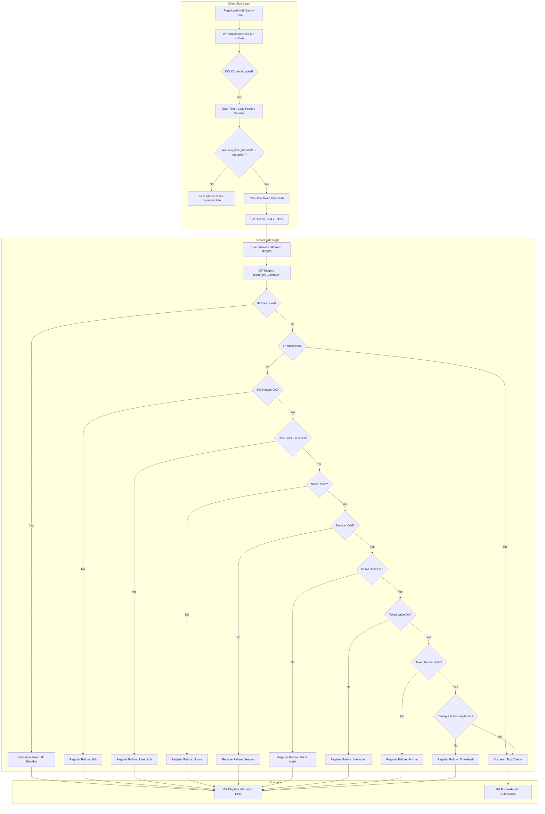

# Flowchart

This diagram outlines the Passive CAPTCHA plugin’s flow, showing both client-side ES module logic and server-side validation.

```mermaid
graph TD
    subgraph Client_Side [Client Side Logic]
        A[Page Load with Gravity Form] --> B[WP Enqueues index.js + pchData]
        B --> C{DOMContentLoaded?}
        C -- Yes --> D[Start Timer, Load Feature Modules]
        D --> E{Wait min_time_threshold + Interaction?}
        E -- No --> F[Set Hidden Field = no_interaction]
        E -- Yes --> G[Calculate Token time:hash]
        G --> H[Set Hidden Field = Token]
    end

    subgraph Server_Side [Server Side Logic]
        H --> I["User Submits GF Form (POST)"]
        I --> J[GF Triggers gform_pre_validation]
        J --> K{IP Blacklisted?}
        K -- Yes --> L[Validation Failed: IP Blacklist]
        K -- No --> M{IP Whitelisted?}
        M -- Yes --> SUCCESS1[Success: Skip Checks]
        M -- No --> N{JA3 Header OK?}
        N -- No --> O[Register Failure: JA3]
        N -- Yes --> P{Rate Limit Exceeded?}
        P -- Yes --> Q[Register Failure: Rate Limit]
        P -- No --> R{Nonce Valid?}
        R -- No --> S[Register Failure: Nonce]
        R -- Yes --> T{Session Valid?}
        T -- No --> U[Register Failure: Session]
        T -- Yes --> V{IP-UA Hash OK?}
        V -- No --> W[Register Failure: IP-UA Hash]
        V -- Yes --> X{Token Value OK?}
        X -- No --> Y[Register Failure: Interaction]
        X -- Yes --> Z{Token Format Valid?}
        Z -- No --> AA[Register Failure: Format]
        Z -- Yes --> AB{Timing & Hash Length OK?}
        AB -- No --> AC[Register Failure: Time-Hash]
        AB -- Yes --> SUCCESS1
    end

    subgraph Outcome [Outcome]
        L --> ERROR[GF Displays Validation Error]
        O --> ERROR
        Q --> ERROR
        S --> ERROR
        U --> ERROR
        W --> ERROR
        Y --> ERROR
        AA --> ERROR
        AC --> ERROR
        SUCCESS1 --> PROCEED[GF Proceeds with Submission]
    end
```
