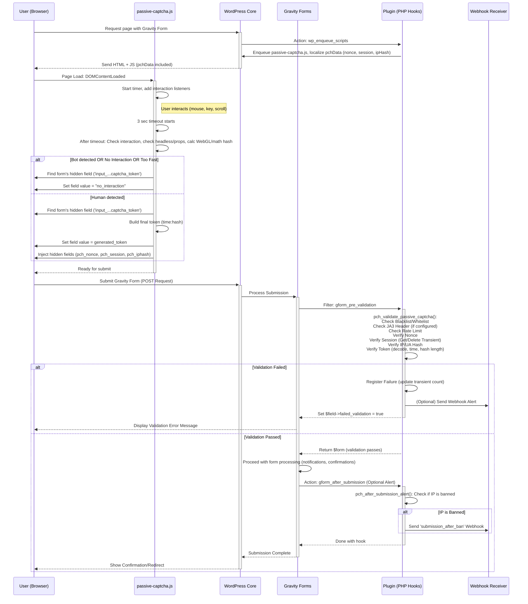

# Sequence Diagram

This documentation outlines the sequence of events when a user interacts with the Passive CAPTCHA system integrated into Gravity Forms via a WordPress plugin.

## User Interaction Sequence

