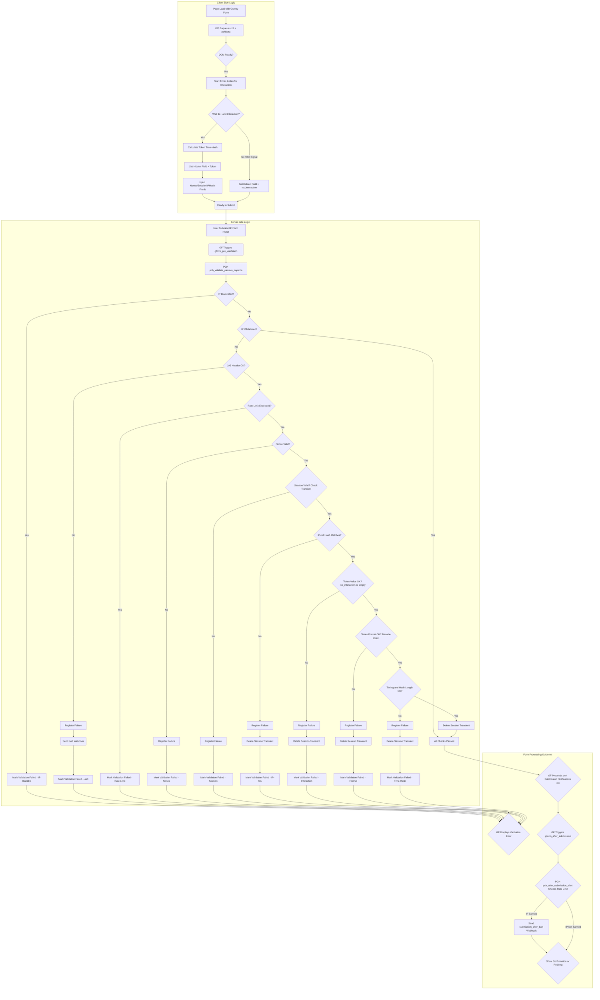

# Flowchart

```mermaid
graph TD
    subgraph Client_Side [Client Side Logic]
        A[Page Load with Gravity Form] --> B(WP Enqueues JS + pchData);
        B --> C{DOM Ready?};
        C -- Yes --> D[Start Timer, Listen for Interaction];
        D --> E{Wait 3s+ and Interaction?};
        E -- No / Bot Signal --> F[Set Hidden Field = no_interaction];
        E -- Yes --> G[Calculate Token Time-Hash];
        G --> H[Set Hidden Field = Token];
        H --> I[Inject Nonce/Session/IPHash Fields];
        I --> J(Ready to Submit);
        F --> J;
    end

    subgraph Server_Side [Server Side Logic]
        K[User Submits GF Form POST] --> L(GF Triggers gform_pre_validation);
        L --> M[PCH pch_validate_passive_captcha];
        M --> N{IP Blacklisted?};
        N -- Yes --> FAIL_BLACKLIST[Mark Validation Failed - IP Blacklist];
        N -- No --> O{IP Whitelisted?};
        O -- Yes --> SUCCESS_CHECKS_PASSED;
        O -- No --> P{JA3 Header OK?};
        P -- No --> Q[Register Failure];
        Q --> R(Send JA3 Webhook);
        R --> FAIL_JA3[Mark Validation Failed - JA3];
        P -- Yes --> S{Rate Limit Exceeded?};
        S -- Yes --> FAIL_RATE[Mark Validation Failed - Rate Limit];
        S -- No --> T{Nonce Valid?};
        T -- No --> U[Register Failure];
        U --> FAIL_NONCE[Mark Validation Failed - Nonce];
        T -- Yes --> V{Session Valid? Check Transient};
        V -- No --> W[Register Failure];
        W --> FAIL_SESSION[Mark Validation Failed - Session];
        V -- Yes --> X{IP-UA Hash Matches?};
        X -- No --> Y[Register Failure];
        Y --> Z[Delete Session Transient];
        Z --> FAIL_IPUA[Mark Validation Failed - IP-UA];
        X -- Yes --> AA{Token Value OK? no_interaction or empty};
        AA -- No --> BB[Register Failure];
        BB --> CC[Delete Session Transient];
        CC --> FAIL_INTERACTION[Mark Validation Failed - Interaction];
        AA -- Yes --> DD{Token Format OK? Decode-Colon};
        DD -- No --> EE[Register Failure];
        EE --> FF[Delete Session Transient];
        FF --> FAIL_FORMAT[Mark Validation Failed - Format];
        DD -- Yes --> GG{Timing and Hash Length OK?};
        GG -- No --> HH[Register Failure];
        HH --> II[Delete Session Transient];
        II --> FAIL_TIMEHASH[Mark Validation Failed - Time-Hash];
        GG -- Yes --> JJ[Delete Session Transient];
        JJ --> SUCCESS_CHECKS_PASSED[All Checks Passed];
    end

    subgraph Outcome [Form Processing Outcome]
         FAIL_BLACKLIST --> DisplayError{GF Displays Validation Error};
         FAIL_JA3 --> DisplayError;
         FAIL_RATE --> DisplayError;
         FAIL_NONCE --> DisplayError;
         FAIL_SESSION --> DisplayError;
         FAIL_IPUA --> DisplayError;
         FAIL_INTERACTION --> DisplayError;
         FAIL_FORMAT --> DisplayError;
         FAIL_TIMEHASH --> DisplayError;
         SUCCESS_CHECKS_PASSED --> ProcessForm{GF Proceeds with Submission Notifications etc};
         ProcessForm --> AfterSubmitHook{GF Triggers gform_after_submission};
         AfterSubmitHook --> CheckBan{PCH pch_after_submission_alert Checks Rate Limit};
         CheckBan -- IP Banned --> SendBanWebhook(Send submission_after_ban Webhook);
         SendBanWebhook --> FinalSuccess;
         CheckBan -- IP Not Banned --> FinalSuccess{Show Confirmation or Redirect};
    end

     J --> K;
```
